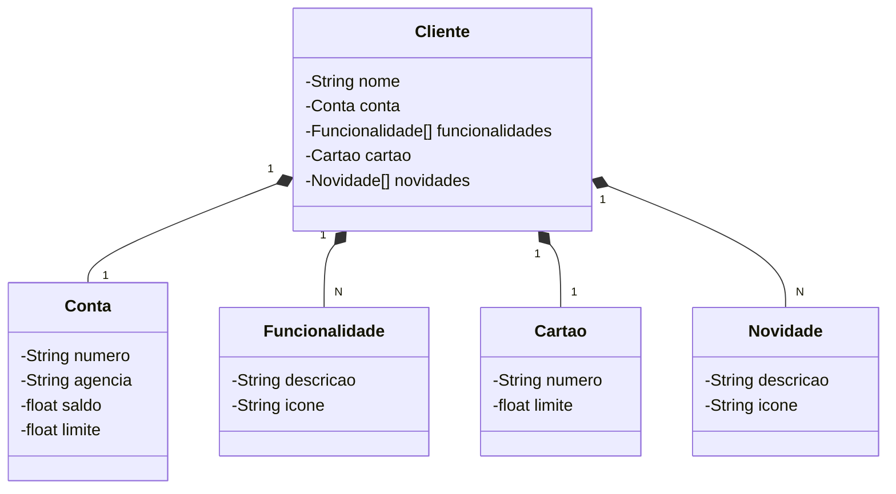

# Bootcamp Santander Full Stack - Dio

### Diagrama de classes da aplicação

```mermaid
classDiagram
    class Cliente {
        -String nome
        -Conta conta
        -Funcionalidade[] funcionalidades
        -Cartao cartao
        -Novidade[] novidades
    }

    class Conta {
        -String numero
        -String agencia
        -float saldo
        -float limite
    }

    class Funcionalidade {
        -String descricao
        -String icone
    }

    class Cartao {
        -String numero
        -float limite
    }

    class Novidade {
        -String descricao
        -String icone
    }

    Cliente "1" *-- "1" Conta
    Cliente "1" *-- "N" Funcionalidade
    Cliente "1" *-- "1" Cartao
    Cliente "1" *-- "N" Novidade
```